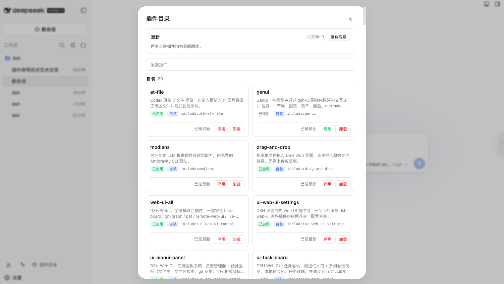

# dsh-plugin-diraud

English | [中文](README.zh.md)


A [DeepSeek Harness](https://github.com/deepseek-ai/deepseek-harness) (DSH)
plugin-management enhancement: group the plugin list by source so you can tell
**official** plugins apart from the ones **you installed yourself** at a glance.

## Features

- **`/plugin-audit` command**: lists the currently loaded plugins grouped by
  official / self-installed, with `user` / `official` / keyword filtering;
- **Self-installed plugin toggles (two surfaces)**:
  - Sidebar footer **Plugin Catalog** entry (icon button; click to open a
    panel): an enable/disable **button** on every self-installed card;
  - Composer: `/plugin-audit disable|enable <keyword>`;
  - Both persist to the profile's `cordis.patch.yml` (kept across restarts,
    reversible) and call `ctx.loader.update` for live effect (HMR-independent);
    official/builtin plugins are locked;
- **Plugin Catalog panel** (sidebar footer entry): grouped cards with a source
  badge and a search box (independent of the built-in "Plugin list" page);
- **Self-installed plugin updates (v0.6)**: the panel's top "Update" section
  checks the npm registry on open, shows the installed vs. latest version for
  every self-installed plugin, and runs `pnpm update` on click (corepack/npx
  fallback, live output); official/builtin plugins and this plugin itself are
  locked;

## Screenshot

Sidebar footer **Plugin Catalog** entry (since v0.5) — click to open the panel: self-installed plugins grouped by origin, each card with an enable/disable toggle:



## Quick start

Prerequisites: `pnpm`, the `dsh` CLI.

```sh
# Install
dsh plugin --profile web add https://github.com/tttwh/dsh-plugin-diraud/archive/refs/heads/main.tar.gz
```

**Restart `dsh web`**, then:

- Type `/plugin-audit` in the composer, or
- Click the **Plugin Catalog** entry at the sidebar footer.

## Commands

| Command | Purpose |
|---|---|
| `/plugin-audit` | Overview: self-installed one-by-one + official count |
| `/plugin-audit user` | Self-installed only |
| `/plugin-audit official` | Official only (full list) |
| `/plugin-audit <keyword>` | Filter by package / entry keyword |
| `/plugin-audit disable <keyword>` | Disable a matching **self-installed** plugin (persisted) |
| `/plugin-audit enable <keyword>` | Enable a matching **self-installed** plugin (persisted) |
| `dsh plugin --profile web remove dsh-plugin-diraud` | Uninstall |

> **How toggles persist**: `disable/enable` writes a `- id: <raw config id>` +
> `disabled: true` override into the profile's `cordis.patch.yml` (the user
> config layer). dsh watches that file (`watchUserPatches`), so the change
> applies live without a restart, survives restarts, and deleting the row
> restores the default.
>
> **Why the raw id (fixed in v0.4)**: loader entries carry a path-prefixed full
> id (`include:ssh`), but the patch layer matches each config row's own `id`
> field (`ssh`). Older versions wrote the prefixed id into the patch file, so
> the row was skipped at boot ("patch: entry not found") and the toggle was
> silently lost on restart. v0.4 writes the raw id, keeps the full id for
> `ctx.loader.update`, and cleans up legacy `include:<id>` rows.

## Configuration

Origin is derived from the package scope by default; edge cases (e.g. a
third-party package published under `@deepseek-ai/`) are overridden via
`extraUserPackages`. Override this plugin's row in the profile's
`cordis.patch.yml`:

```yaml
- id: plugin-audit
  config:
    extraUserPackages:
      - '@deepseek-ai/dsh-my-fork'   # force-classify as self-installed
```

## Repository layout

```text
dsh-plugin-diraud/
  src/classify.ts        origin-classification pure function (single source of truth)
  src/patch.ts           cordis.patch.yml read/write (persist toggles)
  src/toggle.ts          shared toggle core (persist + ctx.loader.update)
  src/contract.ts        typert wire contract (pluginAudit/toggle)
  src/typert.ts          host manifest registration
  src/runtime.ts         PluginAuditRuntime (@Remote toggle; executeToggle unit-tested)
  src/index.ts           host: /plugin-audit command + remote registration
  src/client/            Sidebar Plugin Catalog entry (React) + toggle buttons + client remote
  build.mjs              esbuild build (host ESM + client bundle)
  cordis.patch.yml       profile bundle patch (inserts this plugin)
  demo/                  demo & verification scripts (real-profile output)
```

## Docs

- [DESIGN.md](DESIGN.md) — design rationale and source evidence (why a new tab
  instead of modifying the official one; classification rules and edge cases)

## Related

- [deepseek-harness](https://github.com/deepseek-ai/deepseek-harness) — DeepSeek Harness official repo (DSH itself)
- [omdsh-dev/community](https://github.com/omdsh-dev/community) — community plugin submissions & collaboration hub

## License

[MIT](LICENSE) · Copyright (c) 2025 tttwh
